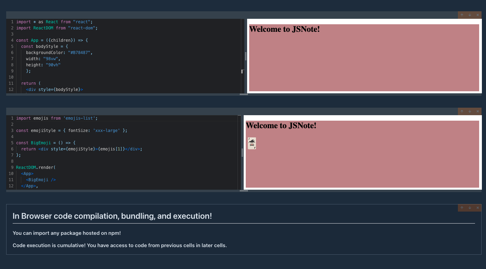

# In Browser Code Executor

_This project was built by following along with a [Typescript / React course on Udemy](https://www.udemy.com/course/react-and-typescript-build-a-portfolio-project/) by [Stephen Grider](https://www.udemy.com/user/sgslo/)._



## Running the app

The easiest way is to run this application is using npx in your terminal. _You may need to update your version of [npm](https://github.com/npm/cli#installation)._

```
npx @javila-jsnote/cli serve
```

**CLI Flags**

- Port flag
  - `-p <number>`
  - Override the default port
- `<filename>.js`
  - Override the default name for the ouput file.

### Learned

- Use [ESbuild Web Asssembly API](https://esbuild.github.io/) to bundle Javascript, JSX, and CSS code in a browser
- Importing NPM packages in browser by using the [Unpkg](https://unpkg.com/) API
- Cache NPM packages using IndexDB with [localforage](https://localforage.github.io/localForage/)
- Execute code in browser using an iFrame
- Publish a suite of packages to npm